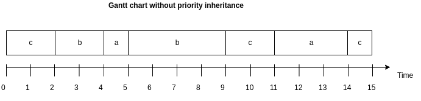
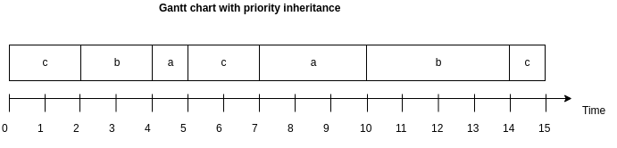

# Exercise 9
## Task 1
  1. In real-time systems, we derive the priority of tasks from its temporal requirements, not its importance to the correct functioning of the system or its integrity. 
  2. For a scheduler to be usable in a real time system, it must pass a necessary and sufficient schedule test. Note that it may work even if the test is only sufficient, and not necessary.
## Task 2
 1. 
 2. 

## Task 3
 1. Priority inversion is an event that occurs when a task is waiting for a lower priority task before it can finish. This typically happens when a lower priority task is blocking a resource.
 2. Priority inheritance does not avoid deadlocks, but shortens its timespan by making the resource available as fast as possible.

## Task 4
 1. - The application is assumed to consist of a fixed set of tasks.
    - All tasks are periodic, with known periods.
      - Real-time systems must be able to handle sporadic events, therefore this is not realistic
    - The tasks are completely independent of each other.
      - It is hard to guarantee that tasks are completely independent, but it may happen. Typically, in a real-time system, they are dependent on each other to a certain degree.
    -  All system overheads, context-switching times and so on are ignored (that is,
    assumed to have zero cost).
        - Large overheads are not desirable, so this may be realistic.
    - All tasks have deadlines equal to their periods (that is, each task must complete
    before it is next released).
        - One may set the period equal to the deadline as long as this is fixed.
    - All tasks have fixed worst-case execution times.
      - With real-time systems, we need to take into account real-time events, and it is hard to give the actions neede a fixed worst-case.
    -  No task contains any internal suspension points (e. g. an internal delay statement
    or a blocking I/O request).
    - All tasks execute on a single processor (CPU).
      - With todays computer technology, this is certainly not realistic, as computers typically use up to seven cores. It may be realistic in embedded systems, as these computers are simpler.
  2. $$U = \sum_{i=1}^{n}{\frac{C_i}{T_i}}$$
     $$U = \frac{15}{50} + \frac{10}{30} + \frac{5}{20} = 0.883 > n(2^{\frac{1}{n}} - 1) = 0.780 $$
     Since the utilization test is only sufficient, and not necessary, it is a pessimistic test. Further, since $U > 0.780$, the task set may or may not be schedulable.
   3. $$w_i ^1 = C_i + \sum_{j\in hp(i)} C_j$$
      $$ w_i ^{n+1} = C_i + \sum_{j\in hp(i)}\frac{w_i ^n}{T_j} C_j$$
      ### For a:
      $$w_1 ^1 = 30$$
      $$w_1 ^2 = 24$$
      $$w_1 ^3 = 20.2$$
      $$w_1 ^3 = 17.79$$
      $$w_1 ^4 = 16.27$$
      $$w_1 ^5 = 15.30$$
      $$w_1 ^n = 13.64$$
      ### for b:
      $$w_2 ^1 = 25$$
      $$w_2 ^2 = 17.5$$
      $$w_2 ^n = 14.29$$
      ### for c:
      $$w_3 ^n = C_3 = 15$$
      Notice that for all the tasks, the worst case execution time is lower than the period. Thus the task set is schedulable.

      Compared to the result of the previous test, this one tests positive. This is because, as mentioned, the utilization test is pessimistic and a failed test does not imply an unschedulable task set. 
